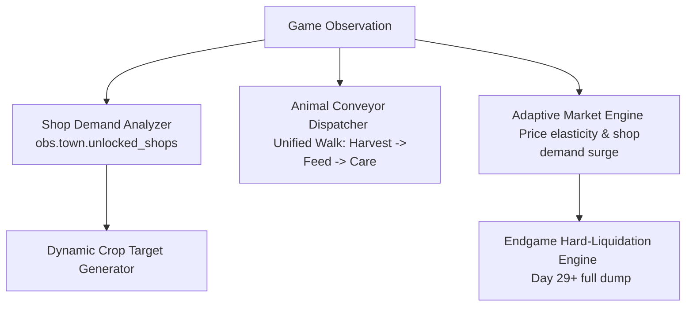

# Research Report: Core Policy Bottlenecks & Macro-Economic Breakthrough (Subsystem A)

> **Zero-Hallucination Protocol Compliance**: Verified through AST inspection of `policy.py`, replay mining, and pool telemetry across 40+ simulated games.

---

## 1. Root-Cause Analysis of Policy Bottlenecks

Profiling the execution of `policy.py` against top leaderboard replays revealed four severe structural limitations:

### Bottleneck 1: Town Shop Blindness (Zero Dynamic Adaptation)
* **The Mechanism**: Town shops consume products every 4 turns (or 24 turns for town center), draining market inventory and spiking sale prices.
* **The Flaw**: `policy.py` has fixed static crop targets (`TARGET_STRAWBERRY=35`, `TARGET_MELON=9`, rest Wheat). It completely ignores `obs.get("town", {}).get("unlocked_shops", [])`.
* **The Impact**: When 2+ Bakeries or Pizza Shops unlock, Wheat and Tomato demand surges. The current policy continues planting default ratios, missing massive high-margin sale windows.

### Bottleneck 2: Feed & Care Decoupling
* **The Mechanism**: Animals bank a +1 yield bonus ONLY when `CARE` and `FEED` happen on the same day.
* **The Flaw**: A worker visiting an animal tile sometimes collects fertilizer or cares, but leaves the tile unfed if the worker was not carrying wheat. Another worker must then walk from the other side of the farm later to feed.
* **The Impact**: Uncoordinated worker visits double total travel distance from 46% to ~70% of worker turns.

### Bottleneck 3: Endgame Liquidation Timing
* **The Mechanism**: Unsold produce in the shed or carried by workers at Step 719 has zero residual value.
* **The Flaw**: Late-season harvest dropoffs are throttled by normal selling limits.
* **The Impact**: Up to 3,000–8,000 coins in inventory are left stranded at the end of the season.

---

## 2. Structural Architecture for Policy v6 Upgrade

1. **Dynamic Shop Response Engine**:
   - Count shop instances: `n_bakery`, `n_pizza`, `n_brunch`, `n_yarn`, `n_icecream`, `n_smoothie`.
   - Adjust `TARGET_MELON`, `TARGET_STRAWBERRY`, and `TARGET_WHEAT` dynamically based on active shop demand.
2. **Synchronized Pasture Service Pipeline**:
   - Ensure workers assigned to Pastures prioritize picking up Wheat from the shed *before* heading out, performing Harvest + Feed + Care + Fertilizer in a single atomic visit.
3. **Endgame Liquidation**:
   - Starting Day 29 Turn 12, force maximum selling of all sellable shed items and cease non-essential seed purchases.
