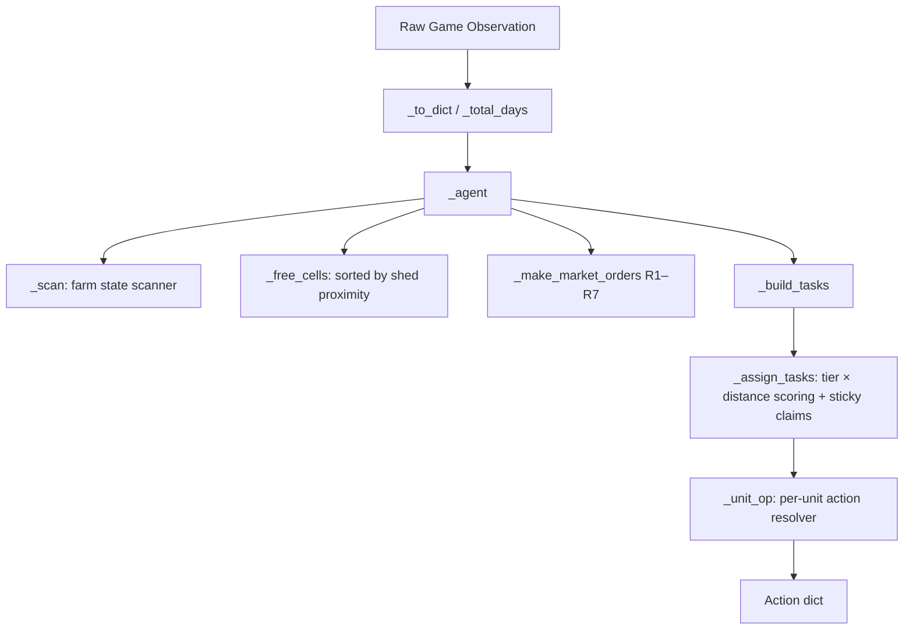

# Agent Brain (Architecture)

This document describes the internal workings of the Kaggriculture agent (current champion: `EXP-20260815-69`).

## Core Architecture: Pure Heuristic Blueprint Engine

The agent is a **pure heuristic rule-based strategy** mined from top-player replays, implemented in [`policy.py`](../policy.py) (880 lines, zero dead code). There is no ML model, no DT, no RL — all such code was removed in the health-check cleanup session.

## Key Files & Roles

| File | Role |
|---|---|
| `policy.py` | **LIVE** — the entire strategy engine (880 lines) |
| `versions/EXP-20260815-69_policy.py` | **Champion archive** — current champion (identical to policy.py minus dead code) |
| `versions/Phase2_v1_policy.py` | Original A1 baseline — used only for historical comparisons |
| `src/autoresearch/evaluator.py` | Multi-stage falsification cascade (stages 0–3) |
| `src/autoresearch/controller.py` | KaggriRatchet autonomous loop |
| `src/autoresearch/hypothesis.py` | Hypothesis generator |
| `src/autoresearch/mutator.py` | Tier 1/2/3 constrained policy mutator + AST linter |
| `src/autoresearch/memory.py` | JSONL experiment ledger |
| `src/autoresearch/stats.py` | Paired t-test, Wilcoxon, Cohen's d, bootstrap CI |

## `_make_market_orders` Rule Summary (R1–R7)

| Rule | Description |
|---|---|
| **R1** | Day 0 hour 0: hard-coded opening blitz (5 HIRE, 2 COW, 2 SHEEP, 11 MELON, 7 WHEAT seeds, 8 WHEAT feed) |
| **R2** | Sell all produce every turn; hold wheat = `feed_hold(animals, shed_wheat, effective_buffer)` where buffer tapers from 2 to 0 in final days |
| **R3** | Re-hire crew every morning (13 hands from day 9) |
| **R4** | Buy land: NE on day 7 ($1k), SW on day 9 ($2k); SE never |
| **R5** | Buy wheat when `need >= fed_animals` (≥1 day short); capped to shed room |
| **R6** | Buy animals to fill empty pastures: 8 COW then 6 SHEEP |
| **R7** | Buy seeds for free tiles: MELON (if ≥13 days left), STRAWBERRY (≥13 days), WHEAT (≥3 days) |

## TASK_TIER Values (current)

| Task | Tier | Notes |
|---|---|---|
| `service` | 0 | Unfed animal — starvation risk tonight |
| `water` | 0 | Plant dies tonight if unwatered |
| `harvest_crop` | 1 | Banks value, frees tile |
| `place_animal` | 1 | Animal in shed earns nothing |
| `service_soon` | 1 | Routine: harvest/collect/care on fed animals |
| `fertilize` | 1 | Doubles strawberry yield (4.8× vs selling fertilizer) |
| `build_pasture` | 2 | |
| `build_coop` | 2 | |
| `plant` | 2 (1 if day ≥ 20) | Endgame: promoted to match service_soon |
| `water_soon` | 3 | Safe today; catch tomorrow |
| `weed` | 4 | |
| `dropoff` | 4 | |
