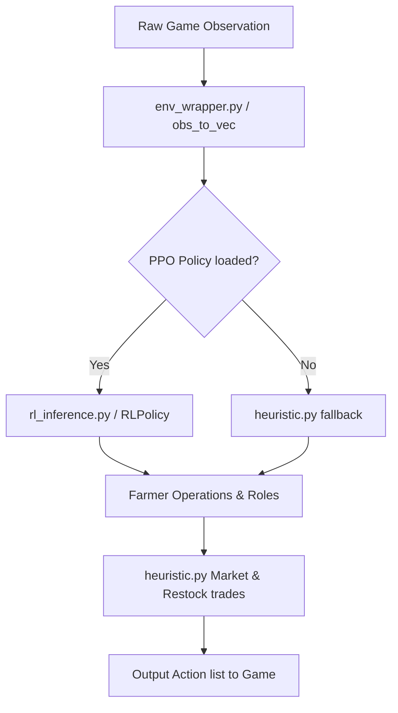

# Agent Brain (Architecture)

This document describes the design and internal workings of the Kaggriculture agent.

## Dual Architecture: Hybrid RL & Heuristic

The agent uses a hybrid approach to maximize efficiency:
1. **Reinforcement Learning Policy (PPO)**: Used for high-level macro planning (e.g., deciding which farmer is assigned to what role, scheduling major plants or pasture builds).
2. **Rule-Based Heuristic**: Handles market trading (buying/selling wheat, carrots, tomatoes, animals, etc.) and low-level action validation.

## Key Files & Roles

- **`main.py` / `ml_main.py`**: The agent entrypoint. Initializes the game loop, parses observations, queries the RL policy or runs fallback heuristics, and outputs actions.
- **`env_wrapper.py`**: Handles feature engineering. Converts the raw game observation dictionary into a standardized numeric vector (`obs_to_vec`) for the RL model, and translates RL action outputs back into farmer actions.
- **`rl_inference.py`**: Defines the neural network architecture (`RLPolicy`) and handles loading weights from the `.npz` file.
- **`rl_weights.npz`**: The saved weights of the trained PPO actor-critic network.
- **`heuristic.py`**: Implements standard rule-based algorithms for crop rotations, feeding schedules, pasture planning, and optimal pricing/market mechanics.
