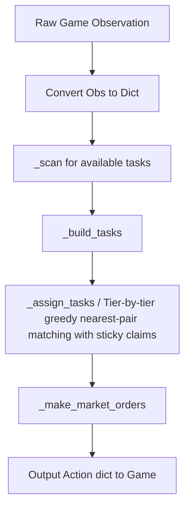

# Agent Brain (Architecture)

This document describes the design and internal workings of the Kaggriculture agent (Version A1, restored 2026-08-12).

## Core Architecture: Heuristic Blueprint Engine

The current agent is a **pure heuristic rule-based strategy** mined directly from top-player replays, implemented in [policy.py](file:///home/gytdrop/Documents/HACKATHONS/2026/kaggle/kagriculture/policy.py). The codebase contains a Decision Transformer implementation and weights (`rl_weights.npz`), but they are **disconnected**: `dt_task` is computed at ~line 1036 but then discarded by `dt_assigned_task = None` at line 1044, before task assignment runs. The DT never influences gameplay. The agent scores **~111k+ mean** locally (8 seeds x 2 seats).

## Key Files & Roles

- **`ml_main.py` / `main.py`**: The agent entrypoint. Delegates to `policy.agent()`.
- **`policy.py`**: The entire strategy engine. Implements tier-based task queuing (service → water → harvest → place → build → plant → weed), sticky task claims across turns to prevent worker oscillation, market order sequencing, prioritized operational task assignment, and livestock feeding/care management.
- **`versions/Phase2_v1_policy.py`**: The validated A1 archive (byte-identical to policy.py as of 2026-08-12). Reference for any future rollback.
- **`versions/heuristic_v7.py`**: The older pure-heuristic baseline before the v6 DT experiment.
- **`rl_weights.npz`**: Dead-weight; the DT is disconnected so these weights are never loaded or used, despite being packaged in the submission tar.

