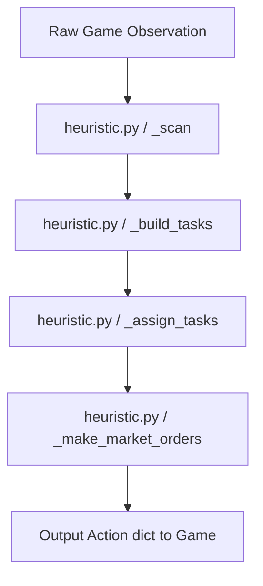

# Agent Brain (Architecture)

This document describes the design and internal workings of the Kaggriculture agent.

## Core Architecture: Pure Heuristic Rule-Based Engine

The current agent is a **pure heuristic rule-based strategy** implemented in [heuristic.py](file:///home/gytdrop/Documents/HACKATHONS/2026/kaggle/kagriculture/heuristic.py). Although the repository initially experimented with a hybrid RL/PPO model, the RL logic was retired after the pure heuristic achieved a massive score breakthrough (from 1.9k to ~123k+).

## Key Files & Roles

- **`ml_main.py` / `main.py`**: The agent entrypoint. Initializes the execution context and delegates step processing directly to the heuristic module.
- **`heuristic.py`**: The entire strategy engine. Implements market pricing estimation, prioritized operational task queues, agricultural spatial compaction algorithms, and livestock feeding management.
- **`versions/`**: Contains legacy archives of the old Reinforcement Learning files (such as `rl_inference_v0.py` and `rl_weights_v0.npz`) if you ever want to reference them.

