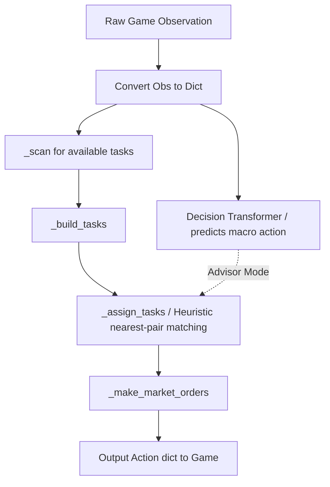

# Agent Brain (Architecture)

This document describes the design and internal workings of the Kaggriculture agent.

## Core Architecture: Hybrid Decision Transformer & Heuristic Engine

The current agent is a **hybrid Decision Transformer & Heuristic rule-based strategy** implemented in [policy.py](file:///home/gytdrop/Documents/HACKATHONS/2026/kaggle/kagriculture/policy.py). It combines a pure NumPy self-attention GPT-style Decision Transformer (DT) with a globally optimal greedy matching heuristic routing system.

## Key Files & Roles

- **`ml_main.py` / `main.py`**: The agent entrypoint. Initializes the execution context and delegates step processing directly to `policy.agent`.
- **`policy.py`**: The entire strategy engine. Implements the NumPy causal transformer block (`DecisionTransformer`), vector state representations (`obs_to_vec`), market order planners, prioritized operational task queues, agricultural spatial compaction algorithms, and livestock feeding management.
- **`train_dt.py`**: PyTorch offline learning script that parses expert trajectories and trains the sequence Decision Transformer model, exporting weights to `rl_weights.npz` format.
- **`versions/`**: Contains legacy archives of the old heuristic files (such as `heuristic_v7.py`).

